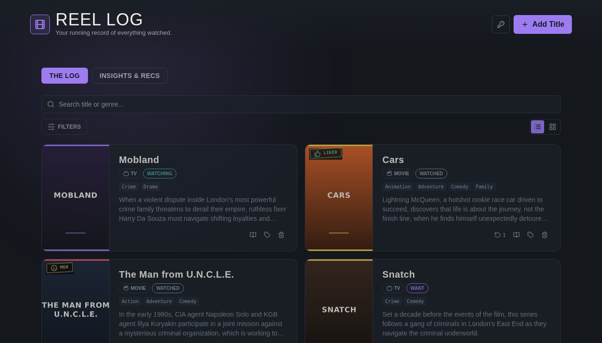
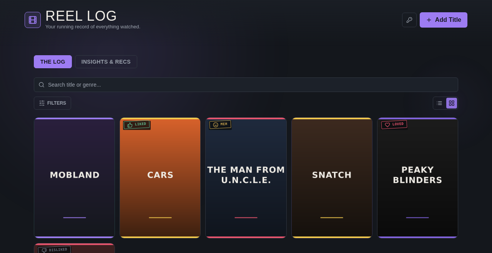
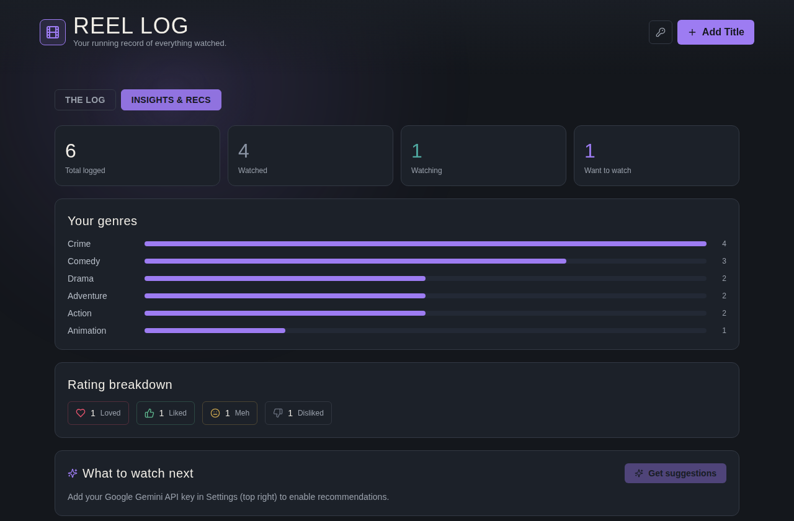

# Reel Log

A tracker for TV shows and movies. Rate them, tag genres, jot notes, log rewatches, and get "what to watch next" suggestions.

Built with Vite + React, deployable on Vercel.

Live app: https://reellog.craftedbyv.com

## Features

- Log shows and movies with status (Want to Watch, Watching, Watched, required), rating (Loved, Liked, Meh, Disliked), genres, and notes, saved to `localStorage`. No account or sign in needed.
- Poster art, synopsis, and genres are looked up automatically the moment a show is saved, via [TMDB](https://www.themoviedb.org/), through a serverless function (`/api/tmdb`) that keeps the TMDB key server side. The "retry poster & genre lookup" button on a card is a fallback for when the automatic lookup fails to find a match.
- Duplicate detection on add and edit, blocks saving the same title and type combination twice.
- Two log views: a detailed Default view and a denser Compact grid. Compact cards expand in place to show full details without leaving the grid.
- A details modal (book icon on each card) for reading the full synopsis or notes when the card's preview text is truncated.
- Filtering by status and type through a filter modal, plus search by title or genre.
- An Insights & Recs tab with basic stats (totals by status, top genres, rating breakdown) and "what to watch next" recommendations, called directly from your browser using your own API key (pasted into Settings, stored only in `localStorage`, never sent to any server but the provider's). Google Gemini is the default (free tier, no card required); Anthropic Claude is available as an alternate provider in the same panel.
- Responsive layout tuned for mobile, tablet, and desktop, with a favicon, Open Graph preview image, and basic SEO tags (title, description, canonical URL, sitemap, robots.txt).

## Screenshots

Default view, Compact view, and the Insights & Recs tab with sample data:







## Local development

```bash
npm install
cp .env.example .env.local   # add your TMDB_API_KEY
npm run dev
```

`npm run dev` runs the Vite dev server only. The `/api/tmdb` serverless function won't be available unless you run it through the Vercel CLI:

```bash
npm install -g vercel
vercel dev
```

## Deploying to Vercel

1. Push this repo to GitHub and import it into Vercel (framework preset: Vite).
2. Set the `TMDB_API_KEY` environment variable in the Vercel project settings. Either a v3 API key or a v4 Read Access Token works (get one at [themoviedb.org](https://www.themoviedb.org/settings/api)).
3. Deploy. `vercel.json` wires up the SPA rewrite and build output automatically.

Each visitor supplies their own Gemini or Anthropic API key via the in-app Settings panel for the recommendations feature. No AI provider key is configured on the server.
